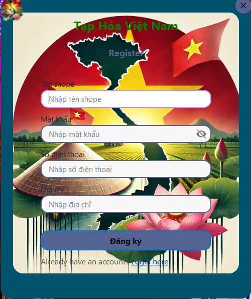
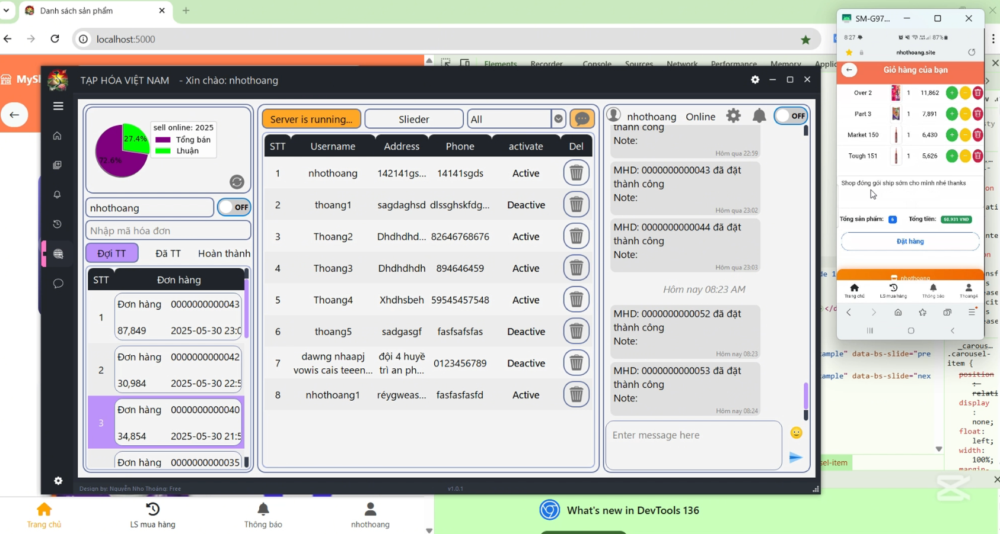
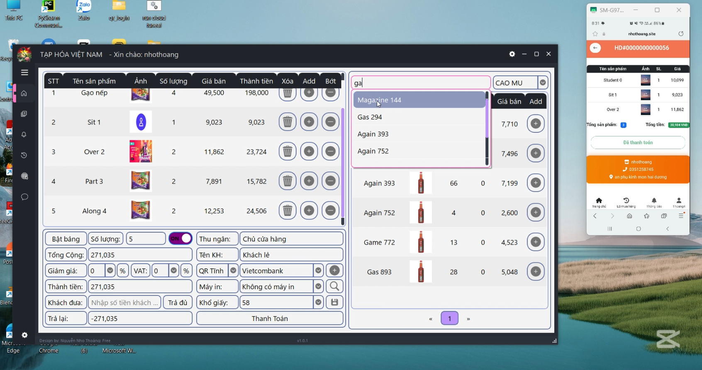

# TAPHOAVN - Phần Mềm Bán Hàng Đa Năng
> **Lưu ý:**
> 
> Phần mềm chỉ hoạt động trên máy tính chạy **Windows**. Các hệ điều hành khác (macOS, Linux, v.v.) hiện **không hỗ trợ**.
## Giao Diện Phần Mềm

**Đăng nhập & Đăng ký:**

<table>
  <tr>
    <td></td>
    <td></td>
  </tr>
  <tr>
    <td align="center">Đăng nhập</td>
    <td align="center">Đăng ký</td>
  </tr>
</table>

**Bán hàng online:**

**Bán hàng offline:**

---

## Giới thiệu

**TAPHOAVN** là phần mềm bán hàng hiện đại, phát triển dành cho cửa hàng, siêu thị, tạp hóa, nhà thuốc và nhiều mô hình kinh doanh khác. Phần mềm tích hợp công nghệ mới, giúp quản lý bán hàng hiệu quả, tiết kiệm thời gian, tăng doanh thu và kiểm soát rủi ro.

## Tính Năng Nổi Bật

- **Quét mã vạch tự động:** Kết nối máy quét mã vạch, nhận diện sản phẩm nhanh, giảm sai sót, tự động tính tiền.
- **In hóa đơn nhiệt:** In hóa đơn chuyên nghiệp, rõ ràng, tiết kiệm giấy và chi phí.
- **Bán hàng online & offline:** Hoạt động cả khi không có internet. Khi cần bán online, khởi động web qua Cloud Tunnel để public website ra ngoài, khách hàng truy cập và mua hàng từ xa.
- **Quản lý kho hàng:** Theo dõi tồn kho, nhập xuất, cảnh báo sản phẩm sắp hết hạn, hết hàng, chủ động nhập hàng, giảm rủi ro tồn kho.
- **Quản lý sản phẩm:** Lưu trữ thông tin chi tiết, giá bán, ngày hết hạn, hình ảnh, mã vạch, phân loại sản phẩm.
- **Quản lý khách hàng & nhà cung cấp:** Lưu thông tin khách hàng, lịch sử mua hàng, công nợ, khuyến mãi, tích điểm. Quản lý nhà cung cấp, lịch sử nhập hàng, công nợ.
- **Thống kê & báo cáo:** Vẽ biểu đồ lịch sử giao dịch, doanh thu, lãi lỗ theo ngày, tháng, năm. Báo cáo chi tiết giúp chủ cửa hàng nắm bắt tình hình kinh doanh mọi lúc mọi nơi.
- **Chat trực tiếp trên web:** Nhắn tin, trao đổi trực tiếp với phần mềm qua giao diện web, hỗ trợ tư vấn khách hàng, xử lý đơn hàng nhanh chóng.
- **Cảnh báo sản phẩm hết hạn:** Tự động cảnh báo sản phẩm sắp hết hạn, chủ động xử lý, giảm rủi ro bán hàng hóa hết hạn.
- **Bán hàng đa kênh:** Bán hàng tại quầy, bán online qua website, quản lý đơn hàng từ nhiều nguồn.
- **Bảo mật & phân quyền:** Quản lý người dùng, phân quyền truy cập, đảm bảo an toàn dữ liệu và bảo mật thông tin kinh doanh.

## Hướng Dẫn Sử Dụng

1. **Cài đặt phần mềm:**
   - Tải file cài đặt tại: [Download](https://github.com/NhoThoang/Taphoavn-realease/releases/download/v1.0.0/install_taphoavn.exe)
   - Xem chi tiết cấu hình trong file `setting.txt`.
   - Hướng dẫn sử dụng trong file `guide.txt`.
   - Xem demo tại [YouTube](https://youtu.be/2mLtMcub_y4?si=cjOopK-ffx-Iwukb).
2. **Kết nối thiết bị:**
   - Gắn máy quét mã vạch và máy in nhiệt vào máy tính.
3. **Thiết lập thông tin cửa hàng, sản phẩm, kho hàng.**
4. **Khởi động web bán hàng online:**
   - Sử dụng Cloud Tunnel để public website, cho phép khách hàng truy cập từ xa.
5. **Quản lý bán hàng, kho, khách hàng, nhà cung cấp** qua giao diện phần mềm.
6. **Theo dõi báo cáo, biểu đồ doanh thu, lãi lỗ, lịch sử giao dịch** để tối ưu hoạt động kinh doanh.
7. **Sử dụng tính năng chat trực tiếp** để hỗ trợ khách hàng và xử lý đơn hàng nhanh chóng.

## Yêu Cầu Hệ Thống

- Máy tính Windows
- Kết nối internet (để sử dụng tính năng bán hàng online)
- Máy quét mã vạch, máy in nhiệt (khuyến nghị)

## Liên Hệ & Hỗ Trợ

- **Tác giả:** [NhoThoang](https://github.com/NhoThoang)
- **Email:** nhothoang@gmail.com
- **Website:** Đang cập nhật
  Đây là bản free cho các nhân nghiêm cấm các hành vi sửa đổi web rồi bán lại cho người khác nếu vi phạm sẽ bị sử lý theo pháp luật
---

> **TAPHOAVN** - Giải pháp bán hàng toàn diện, giúp bạn quản lý kinh doanh hiệu quả, tiết kiệm thời gian, tăng lợi nhuận và kiểm soát rủi ro!
